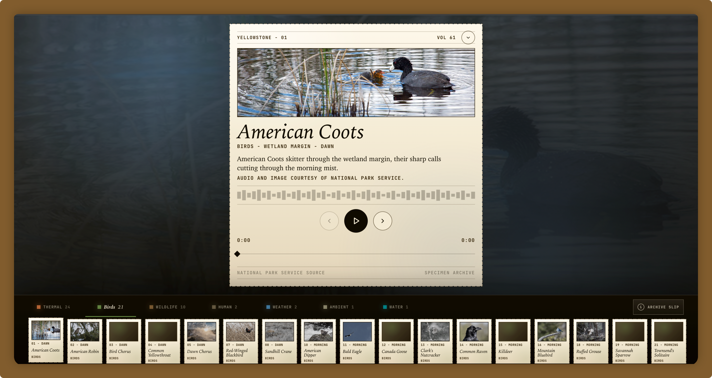

# YSL



[](https://github.com/rosuH/YSL/actions/workflows/spider_action.yml)
[](https://www.python.org/downloads/)
[](LICENSE)

YSL collects the public Yellowstone National Park sound library and turns it into a browsable, shareable listening atlas. The repository contains the downloaded audio/image archive, the crawler that keeps it updated, and a static web experience for exploring the sounds as field specimens.

## What Is Included

- `spider.py` downloads and deduplicates Yellowstone Sound Library media.
- Downloaded `.mp3` and `.jpg` files are stored as repository assets.
- `atlas/` contains the static Yellowstone Sound Atlas web experience.
- `atlas/dawn-to-night.json` is the route metadata used by the atlas.
- Tests validate crawler behavior, route metadata, static assets, and the local preview helper.

## Sound Atlas

The atlas is a static listening interface built from this repository's media files.

It supports English, Simplified Chinese, Japanese, and Korean. Use the in-page language switcher to change player labels, specimen notes, theme navigation, and share copy without leaving the current sound.

```bash
python -m http.server 8000
```

Then open <http://localhost:8000/atlas/>.

The browser reads `atlas/dawn-to-night.json`; it does not scan folders at runtime. Public share links use static per-specimen pages so social platforms can read the right preview metadata:

```text
https://ysl.rosuh.me/atlas/share/american-coots/
```

Opening a share page redirects to the matching player state, such as `https://ysl.rosuh.me/atlas/#american-coots`.

## Updating The Archive

The manual **Spider Data Collection** GitHub Action runs the crawler, updates the atlas route, verifies the route, and commits any changed media or metadata.

For local updates:

```bash
make run
make build-atlas-route
make check-atlas-route
pytest -v
```

`make build-atlas-route` writes directly to `atlas/dawn-to-night.json`. Existing curated entries are preserved; newly discovered audio files are added with generated theme, time-of-day, zone, credit, image, and field-note metadata.

## Download

GitHub has a size limit on uploaded files, so the full archive is also available on the [Web Archive](https://archive.org/details/YSL.7z). You can also clone this repository directly.

## Project Layout

```text
.
├── atlas/                  # Static Yellowstone Sound Atlas
├── docs/assets/            # README and documentation imagery
├── scripts/                # Local preview and atlas route helpers
├── tests/                  # Crawler, atlas, and static-site tests
├── spider.py               # Yellowstone Sound Library crawler
└── README.md
```

## Credit And Legal Notice

This repository collects public sound libraries from [Yellowstone National Park](https://www.nps.gov/yell/learn/photosmultimedia/soundlibrary.htm).

According to the Yellowstone Sound Library page, the provided audio files were recorded in the park, are in the public domain, and may be downloaded and used without limitation. Please credit the **National Park Service** where appropriate.

### Compliance Statement

**Copyright Status**: According to the [NPS Disclaimer](https://www.nps.gov/aboutus/disclaimer.htm), works created by U.S. federal government employees as part of their official duties are generally in the public domain under 17 U.S.C. §§ 101, 105. The Yellowstone Sound Library explicitly states that its audio files are in the public domain.

**Web Crawling**: This project uses an automated crawler to download files. The crawler:

- Respects the site's [`robots.txt`](https://www.nps.gov/robots.txt); the sound library path is not disallowed.
- Identifies itself with a descriptive `User-Agent` including this repository's URL.
- Uses a polite request delay, 2 seconds by default, to avoid overloading NPS servers.

**Usage Risk**: While NPS labels these audio files as public domain, not all materials on NPS websites are guaranteed to be free of third-party rights. Users are responsible for determining whether their use case requires additional permissions. If any file in this repository is found to infringe on third-party rights, please [open an issue](https://github.com/rosuH/YSL/issues) and it will be removed.

## Inspiration

[tonyq0802's tweet](https://twitter.com/tonyq0802/status/1084364955506290688)

---

## 中文说明

YSL 收集 Yellowstone National Park 的公开声音库，并把这些音频和图片整理成一个可以浏览、播放、分享的静态声音图谱。这个仓库既是声音素材归档，也是爬虫和前端展示的完整项目。

### 包含内容

- `spider.py`：下载并去重 Yellowstone Sound Library 素材。
- 仓库内的 `.mp3` / `.jpg`：已采集的声音和图片资源。
- `atlas/`：静态 Yellowstone Sound Atlas 页面。
- `atlas/dawn-to-night.json`：图谱读取的路线元数据。
- `tests/`：爬虫、图谱数据、静态页面和预览服务测试。

### 本地预览

图谱支持英文、简体中文、日文与韩文。可以使用页面内的语言切换器，在不中断当前声音的情况下切换播放器标签、标本札记、主题导航与分享文案。

```bash
python -m http.server 8000
```

然后打开 <http://localhost:8000/atlas/>。

网页读取的是 `atlas/dawn-to-night.json`，不会在浏览器里扫描资源目录。公开分享链接使用每个声音条目的静态分享页，这样社交平台可以读取对应的预览信息：

```text
https://ysl.rosuh.me/atlas/share/american-coots/
```

打开分享页后会跳转到对应播放器状态，例如 `https://ysl.rosuh.me/atlas/#american-coots`。

### 更新资源

手动触发的 **Spider Data Collection** GitHub Action 会运行爬虫、更新图谱元数据、检查 route，并把新增资源和元数据一起提交。

本地更新可以运行：

```bash
make run
make build-atlas-route
make check-atlas-route
pytest -v
```

`make build-atlas-route` 会直接写入 `atlas/dawn-to-night.json`。已有人工整理条目会被保留，新发现的音频会自动补上主题、时间、区域、署名、图片和 field note。

### 下载

因为 GitHub 对上传文件大小有限制，完整归档也上传到了 [Web Archive](https://archive.org/details/YSL.7z)。当然，也可以直接 clone 本仓库。

### 版权与使用说明

本仓库素材来自 [Yellowstone National Park](https://www.nps.gov/yell/learn/photosmultimedia/soundlibrary.htm) 的公开声音库。NPS 声音库页面说明这些音频在公园内录制、属于公共领域，可以无限制下载和使用；请在合适的位置注明 **National Park Service**。

爬虫会遵守 `robots.txt`、使用带仓库 URL 的 `User-Agent`，并默认保持 2 秒请求间隔。如果本仓库中的任何文件被发现侵犯第三方权利，请立即[提交 issue](https://github.com/rosuH/YSL/issues)，我会处理并移除。
